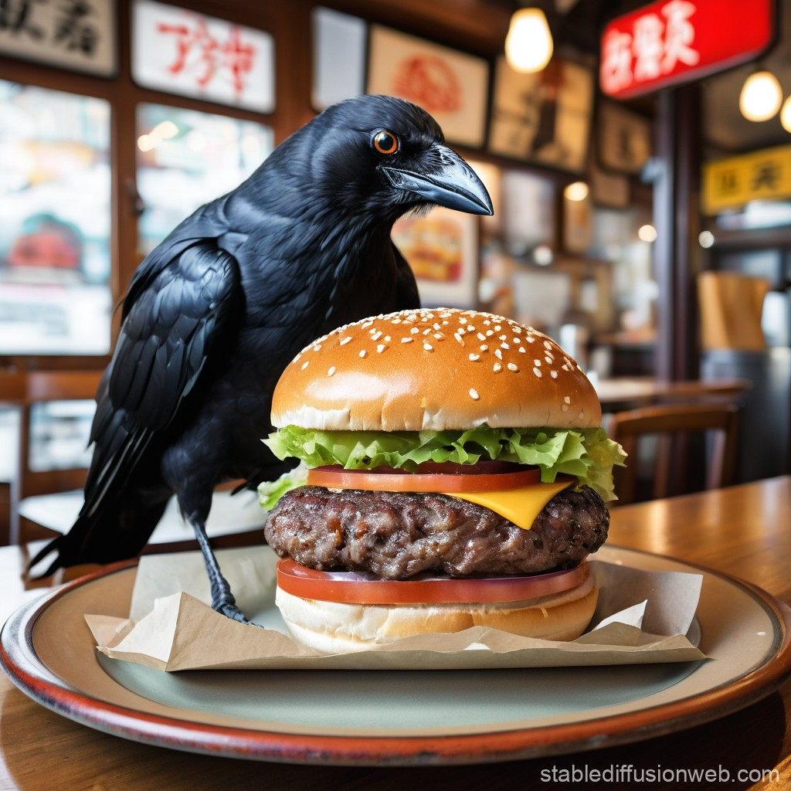

```{r setup, include=FALSE}
knitr::opts_chunk$set(echo = TRUE)
library(dplyr)
library(ggplot2)
library(tidyverse)  #importing, tidying, plotting data
library(knitr)      #making tables
library(leaflet)
library(hexbin)
library(tidyr)
library(lme4)
library(lmerTest)
library(arm)
library(performance)
crow <- read.table("data/crow_cholesterol_data.txt", header = TRUE, sep = "\t")
```

```{r clean up data, include=FALSE}
summary(crow)
crow$population <- as.factor(crow$population)
crow$supplemented <- as.factor(crow$supplemented)
```

```{r subset to 10 familes each, include=FALSE}
crow <- filter(crow, family <= 12 | family == 15 | family == 21 | family == 23 | family == 45 | family == 52 | family == 53 | family == 59 | family == 63 | family == 75)
crow$family <- as.factor(crow$family)
```


## Crow Cholesterol Data

Animals living in urban environments tend to eat different food sources than their counterparts in rural environments. Elevated cholesterol levels in urban wildlife could indicate the inclusion of high-calorie, high-fat antrhopogenic foods in their diet. This greasier food source could impact individuals' health and fitness over their lifetime.  

American crows are known to easily adapt to an urban lifestyle. They are omnivorous and will eat almost anything they can find on the ground including worms, seeds, fruit, insects, carrion, and even garbage. Crows hang out in flocks or family groups. The family groups consists of the parents and their offspring. Young crows up to two years old will remain with their parents and help care for their younger siblings. 

One team of researchers decided to look at how urbanization might impact the cholesterol levels of the American Crow. The researchers measured the cholesterol levels of nestling crows in Davis, CA and in Clinton, NY. Crows in Clinton, NY were also supplemented with McDonalds cheeseburgers. To simplify the dataset for this example, we will only be looking at ten crow families from each population. You can check out the dataset on [Dryad.](https://datadryad.org/dataset/doi:10.5061/dryad.t7r7899#usage)

<center>
<iframe src="https://macaulaylibrary.org/asset/642291976/embed" height="390" width="320" frameborder="0" allowfullscreen></iframe>
<iframe src="https://macaulaylibrary.org/asset/256800971/embed" height="401" width="320" frameborder="0" allowfullscreen></iframe>
</center>

```{r ggplot cholesterol, fig.align='center', message=FALSE}
ggplot(data = crow, aes(x = Impervious10ha, y = Cholesterol)) + 
  geom_point() + 
  stat_smooth(method = "lm", se = FALSE) + 
  facet_wrap(.~population) + 
  xlab("Percentage of Impervious Surface") + 
  ylab("Cholesterol Level")
```

## Running Models 

### Does urbanization impact the cholesterol level of crows? 

```{r linear mixed models}
lmm.1 <- lmer(Cholesterol ~ Impervious10ha + (1|family), data = crow)
```

**Fixed Effects:**  The average relationship between the percent of impervious surfaces in 10 ha and cholesterol levels. 

**Random Effects:**  There should be a random intercept for each family. Nestlings from the same family are not truly independent samples and are likely to have similar cholesterol readings as they are more genetically similar and are being fed the same food items. 

```{r lmm summary}
summary(lmm.1)
```

The number of observations and family groups matches up with what is expected. The df are low. There is no significant p value. 

```{r plot lmm 1}
ggplot(data = crow, aes(x = Impervious10ha, y = Cholesterol)) + 
  geom_point() + 
  stat_smooth(method = "lm", se = FALSE) + 
  xlab("Percentage of Impervious Surface") + 
  ylab("Cholesterol Level")
```


### Does feeding crows Mcdonalds increase their cholesterol? 

```{r lmm sufaces}
lmm.2 <- lmer(Cholesterol ~ population + (1|family), data = crow)
```

**Fixed Effects:** Is there a difference in cholesterol levels of crows fed McDonalds cheeseburgers. 

**Random Effects:** There should be a random intercept for each family. Nestlings from the same family are not truly independent samples and are likely to have similar cholesterol readings as they are more genetically similar and are being fed the same food items.

```{r lmm surfaces summary}
summary(lmm.2)
```

The number of observations and family groups matches up. The df are a little higher than in the previous model. There is no significant p value. 

```{r compare model summaries}
arm::display(lmm.1)
arm::display(lmm.2)
```

```{r compare performance of models}
performance::compare_performance(lmm.1, lmm.2)
```
Comparing the performance of the two models, neither model is particularly good at explaining the data we have with 80 observations in 20 crow families. Both models were not statistically significant with their fixed effects. Both models ar every similar in the AIC values and have relatively low degrees of freedom. 

<center>
{width="600"}
</center>
